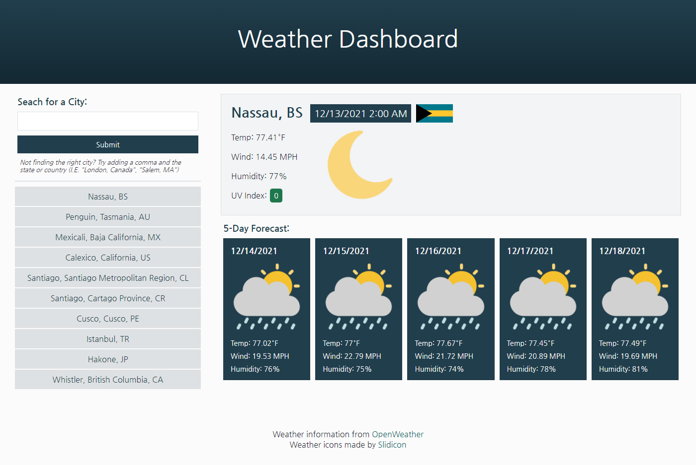

# Weather Dashboard
Using the OpenWeather API, this weather dashboard allows users to look up cities across the world to view the current weather and weather of the upcoming 5 days. Each city search displays the current day, time, weather, wind speed, humidity, and UV Index, along with icons for both the current weather and the country flag. The five-day forecast shows the predicted average temperature, wind speed, and humiditiy, as well as an icon of the weather.\
The search is intutive to allow users to look up multiple cities of the same name (like Salem, MA and Salem, OR). The ten most recent searches show up under the search box for easy access to recently seen cities (the most recent being on top). (The amount of recent cities decreases from ten to five for mobile phones, so not too much valuable screenspace is taken up). However, if a search is vague, the user is also presented with a message and links to additional cities under a similar name.\
In the top right, there is a toggle button to change units from Fahrenheit (the default) to Celsius, and in doing so, also changes miles to km (for the speed) and the date format from month/day to day/month.

# View Live Page
[View the live Weather Dashboard page on GitHub.](https://jcolecodes.github.io/weather-dashboard-challenge-06/)

# Screenshot

# Weather icons credit
Icons made by [Slidicon](https://www.flaticon.com/authors/slidicon) from [www.flaticon.com](https://www.flaticon.com/)